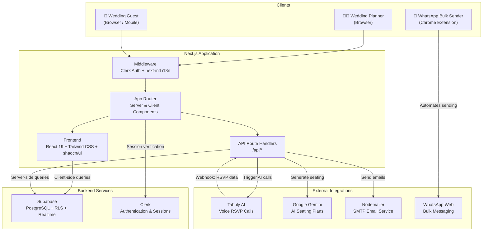
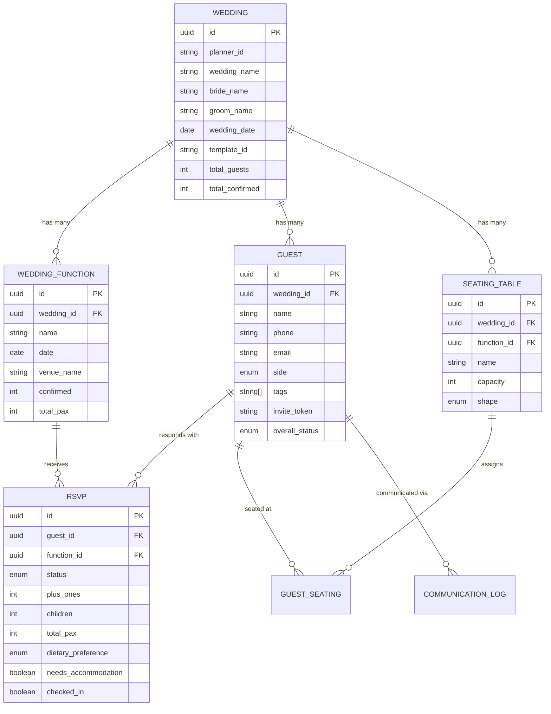
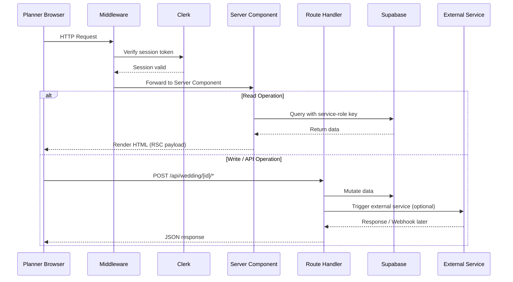

# WedSync — System Architecture & Tech Stack Documentation

> **Project Name:** WedSync (WedTech)
> **Project Type:** Full-Stack Web Application
> **Description:** WedSync is a production-grade Indian wedding RSVP & guest management platform that consolidates wedding planning workflows — guest list management, multi-event RSVP collection, AI-powered voice calls, QR-based check-in, real-time analytics, and bulk communication — into a single, seamlessly integrated system.
> **Target Users:** Indian wedding planners and their guests.
> **Scale:** Medium-scale SaaS system designed for concurrent multi-wedding management.

---

## Table of Contents

- [1. System Architecture](#1-system-architecture)
  - [1.1 High-Level Architecture](#11-high-level-architecture)
  - [1.2 Architecture Diagram](#12-architecture-diagram)
  - [1.3 Component Breakdown](#13-component-breakdown)
- [2. Tech Stack Documentation](#2-tech-stack-documentation)
  - [2.1 Tech Stack Overview Table](#21-tech-stack-overview-table)
  - [2.2 Detailed Tech Explanation](#22-detailed-tech-explanation)
  - [2.3 Data Flow Explanation](#23-data-flow-explanation)
  - [2.4 Scalability & Design Considerations](#24-scalability--design-considerations)
  - [2.5 Folder Structure](#25-folder-structure)

---

# 1. System Architecture

## 1.1 High-Level Architecture

WedSync follows a **server-rendered monolithic architecture** powered by **Next.js (App Router)**, where the frontend and backend coexist within a single deployable unit. This choice maximises development velocity while providing a clear separation of concerns through the file-system–based routing convention.

**Key Architectural Tenets:**

| Tenet | Implementation |
|---|---|
| **Rendering Strategy** | Server Components by default; Client Components only for interactive UI (forms, modals, real-time updates). |
| **API Layer** | Next.js Route Handlers (`app/api/`) serve as lightweight REST endpoints for webhook ingestion, data export, and external service proxying. |
| **Database** | Supabase (managed PostgreSQL) with Row-Level Security (RLS) policies ensuring data isolation per planner. |
| **Authentication** | Clerk handles all identity management (sign-up, sign-in, session tokens) via middleware-level route protection. |
| **External Integrations** | Tabbly AI (voice RSVP calls), Google Gemini (AI seating plans), Nodemailer (transactional email), WhatsApp Web (bulk invites via Chrome Extension). |
| **Internationalization** | `next-intl` with locale-segmented routing (`/en/`, `/hi/`). |

**Data flows through the system in a unidirectional pattern:**

1. **Planner** authenticates via Clerk → accesses the dashboard.
2. Dashboard pages (Server Components) fetch data directly from Supabase using the service-role client.
3. Mutations trigger API Route Handlers or direct Supabase client calls.
4. **Guests** receive a tokenised invite link → land on a public RSVP page → submit responses.
5. **External services** (Tabbly webhooks) push RSVP data into the system via API webhook endpoints.

---

## 1.2 Architecture Diagram

### 1.2.1 Full System Architecture



### 1.2.2 Data Model Relationships



### 1.2.3 Request Flow



---

## 1.3 Component Breakdown

### 1.3.1 Frontend

| Aspect | Detail |
|---|---|
| **Purpose** | Deliver the planner dashboard and guest-facing invite experience. |
| **Responsibilities** | UI rendering, form handling, client-side state, real-time updates, dynamic theming. |
| **Technologies** | React 19, Next.js App Router, Tailwind CSS v4, shadcn/ui, Lucide React icons, Sonner toasts. |

**Key Pages:**

| Route | Description |
|---|---|
| `/[locale]/` | Marketing landing page |
| `/[locale]/(auth)/sign-in` | Clerk-hosted sign-in |
| `/[locale]/(planner)/dashboard` | Wedding list & creation |
| `/[locale]/(planner)/wedding/[id]/guests` | Guest list management with CSV/Excel import |
| `/[locale]/(planner)/wedding/[id]/invites` | Invitation sending & status tracking |
| `/[locale]/(planner)/wedding/[id]/analytics` | Real-time RSVP analytics dashboard |
| `/[locale]/(planner)/wedding/[id]/seating` | AI-powered seating plan management |
| `/[locale]/(planner)/wedding/[id]/checkin` | QR code–based event-day check-in kiosk |
| `/[locale]/(planner)/wedding/[id]/briefings` | Vendor/family briefing documents |
| `/[locale]/invite/[token]` | Public guest RSVP page (no auth required) |

---

### 1.3.2 Backend (API Layer)

| Aspect | Detail |
|---|---|
| **Purpose** | Handle server-side mutations, webhook ingestion, and external service orchestration. |
| **Responsibilities** | Data validation, Supabase mutations, email dispatch, AI orchestration, data export. |
| **Technologies** | Next.js Route Handlers, Supabase JS client (service-role), Nodemailer, Google GenAI SDK, Tabbly API. |

**API Endpoints:**

| Endpoint | Method | Purpose |
|---|---|---|
| `/api/wedding/[id]/*` | Various | Wedding CRUD operations, guest management, RSVP processing |
| `/api/export/[id]/*` | GET | Generate and download Excel reports |
| `/api/smtp-settings` | GET/POST | Manage planner's custom SMTP configuration |
| `/api/webhooks/tabbly` | POST | Receive AI voice call RSVP results from Tabbly |

---

### 1.3.3 Database

| Aspect | Detail |
|---|---|
| **Purpose** | Persistent storage of all wedding data with real-time subscription support. |
| **Responsibilities** | Data integrity, access control via RLS, real-time change broadcasting. |
| **Technologies** | Supabase (managed PostgreSQL), Row-Level Security, Supabase Realtime. |

**Core Tables:** `weddings`, `wedding_functions`, `guests`, `rsvps`, `invite_tokens`, `seating_tables`, `guest_seating`, `communication_logs`.

---

### 1.3.4 Authentication

| Aspect | Detail |
|---|---|
| **Purpose** | Secure planner identity management; public guest access via token-based links. |
| **Responsibilities** | User sign-up/sign-in, session management, middleware route protection. |
| **Technologies** | Clerk (`@clerk/nextjs`), Next.js Middleware. |

**Strategy:**
- **Protected routes** (`/dashboard/*`, `/wedding/*`) — enforced by `clerkMiddleware` + `createRouteMatcher`.
- **Public routes** (`/invite/[token]`) — no authentication required; guest identity resolved via unique invite token.

---

### 1.3.5 External Integrations

| Integration | Purpose | Communication |
|---|---|---|
| **Tabbly AI** | Automated voice calls to collect RSVP responses from guests who haven't responded. | Outbound: REST API to trigger calls. Inbound: Webhook at `/api/webhooks/tabbly` for call results. |
| **Google Gemini** | AI-generated optimal seating arrangements based on guest relationships, dietary needs, and group affinities. | Outbound: `@google/genai` SDK for prompt-based generation. |
| **Nodemailer** | Send personalised email invitations with custom SMTP settings per planner. | Outbound: SMTP transport with encrypted credential storage. |
| **WhatsApp Web** | Bulk invitation delivery via a custom Chrome Extension that automates WhatsApp Web. | The Chrome Extension reads a JSON payload (names + messages) exported from the dashboard and sends messages with randomised delays (5–8s) to avoid anti-spam detection. |

---

# 2. Tech Stack Documentation

## 2.1 Tech Stack Overview Table

| Layer | Technology | Version | Purpose |
|---|---|---|---|
| **Framework** | Next.js (App Router) | 16.1.6 | Full-stack React framework with SSR/SSG, API routes, and file-system routing. |
| **UI Library** | React | 19.2.3 | Component-based UI rendering with Server Components support. |
| **Language** | TypeScript | 5.x | Static typing for reliability and developer experience. |
| **Styling** | Tailwind CSS | 4.x | Utility-first CSS framework for rapid, consistent UI development. |
| **Component Library** | shadcn/ui | 4.x | Accessible, customizable headless UI components built on Radix primitives. |
| **Icons** | Lucide React | 0.577.x | Consistent, tree-shakeable SVG icon set. |
| **Notifications** | Sonner | 2.x | Lightweight toast notification system. |
| **Database** | Supabase (PostgreSQL) | Client 2.99.x | Managed PostgreSQL with RLS, Realtime, and auto-generated REST APIs. |
| **Authentication** | Clerk | 7.x | Drop-in auth with social logins, session management, and middleware integration. |
| **Internationalization** | next-intl | 4.x | Locale-segmented routing with message-based translations (English, Hindi). |
| **AI — Seating** | Google Gemini | GenAI SDK 1.45.x | LLM-powered seating plan generation. |
| **AI — Voice RSVP** | Tabbly AI | REST API | Automated voice calls for RSVP collection. |
| **Email** | Nodemailer | 8.x | SMTP-based transactional email with per-planner custom settings. |
| **QR Codes** | qrcode + html5-qrcode | 1.5.x / 2.3.x | QR generation for event passes and real-time scanning for check-in. |
| **Data Processing** | PapaParse + xlsx | 5.x / 0.18.x | CSV parsing and Excel report generation for guest import/export. |
| **Form Handling** | React Hook Form + Zod | 7.x / 4.x | Performant form state management with schema-based validation. |
| **Encryption** | Node.js Crypto | Built-in | AES encryption for storing SMTP passwords at rest. |
| **Chrome Extension** | Manifest V3 | — | Automates WhatsApp Web for bulk invite sending. |
| **Build Tool** | Turbopack | Built-in | Next.js's Rust-based bundler for fast development builds. |
| **Deployment** | Vercel (recommended) | — | Zero-config deployment for Next.js with edge functions and CDN. |

---

## 2.2 Detailed Tech Explanation

### Next.js 16 (App Router)

| Aspect | Detail |
|---|---|
| **Why chosen** | Provides a unified full-stack framework: SSR for SEO-critical landing pages, Server Components for data-intensive dashboards, Client Components for interactive forms, and API Route Handlers for backend logic — all in a single deployable unit. |
| **Key features used** | App Router (file-system routing), React Server Components, Route Handlers, Middleware, Dynamic route segments (`[locale]`, `[id]`, `[token]`), Turbopack dev server. |
| **Alternatives considered** | Remix (less mature ecosystem), Vite + Express (requires separate frontend/backend management), Nuxt (Vue ecosystem). |

---

### Supabase (PostgreSQL)

| Aspect | Detail |
|---|---|
| **Why chosen** | Managed PostgreSQL with built-in Row-Level Security eliminates the need for a custom authorization layer. The Realtime engine enables live dashboard updates without WebSocket boilerplate. The JS client provides type-safe query building. |
| **Key features used** | Row-Level Security (data isolation per `planner_id`), Realtime subscriptions (live RSVP counters), service-role key for server-side admin operations, anon key for client-side reads. |
| **Alternatives considered** | Firebase (NoSQL limitations for relational wedding data), PlanetScale (no built-in RLS), raw PostgreSQL (operational overhead). |

---

### Clerk

| Aspect | Detail |
|---|---|
| **Why chosen** | Production-ready authentication with zero custom auth code. Provides pre-built sign-in/sign-up UI, session management, and first-class Next.js middleware integration. Avoids the security risks of rolling custom JWT infrastructure. |
| **Key features used** | `clerkMiddleware` for route protection, `createRouteMatcher` for pattern-based access control, `useAuth` / `useUser` hooks for client-side identity. |
| **Alternatives considered** | NextAuth (more configuration overhead), Supabase Auth (would couple auth to database provider), Auth0 (more complex pricing for small-scale). |

---

### Tailwind CSS v4 + shadcn/ui

| Aspect | Detail |
|---|---|
| **Why chosen** | Tailwind provides utility-first styling that scales without CSS file bloat. shadcn/ui provides accessible, customizable components that integrate natively with Tailwind — unlike pre-styled libraries, components are copied into the project for full ownership. |
| **Key features used** | CSS custom properties for dynamic wedding template theming (`floral`, `royal`, `minimal`, `dark`, `bohemian`), responsive breakpoints for mobile-first guest experience, dark mode via `next-themes`. |
| **Alternatives considered** | Material UI (heavier, opinionated), Chakra UI (runtime CSS-in-JS overhead), vanilla CSS (slower development). |

---

### Google Gemini (AI Seating Plans)

| Aspect | Detail |
|---|---|
| **Why chosen** | Gemini's large context window and instruction-following capabilities make it ideal for the complex constraint-satisfaction problem of wedding seating: balancing group affinities, dietary needs, table capacities, and social dynamics. |
| **Key features used** | Structured prompt engineering with JSON schema output, guest relationship analysis, capacity-aware table assignment. |
| **Alternatives considered** | OpenAI GPT-4 (higher cost per token), custom algorithmic solver (less flexible, harder to encode social preferences). |

---

### Tabbly AI (Voice RSVP)

| Aspect | Detail |
|---|---|
| **Why chosen** | Enables automated voice calls to guests who haven't responded to digital invitations — critical for the Indian wedding demographic where older family members may not engage with digital RSVPs. |
| **Key features used** | Outbound call triggering via REST API, webhook-based result delivery, natural conversation flow for attendance, guest count, and dietary preference collection. |
| **Alternatives considered** | Twilio (requires building custom voice AI), manual follow-up calls (not scalable). |

---

### Nodemailer + Custom SMTP

| Aspect | Detail |
|---|---|
| **Why chosen** | Allows each planner to configure their own SMTP server (e.g., Gmail, Outlook, custom domain), so invitations appear to come from the planner's personal email — increasing trust and open rates. SMTP credentials are encrypted at rest using AES. |
| **Key features used** | Dynamic transport creation per planner, HTML email templates, encrypted credential storage via Node.js `crypto` module. |
| **Alternatives considered** | SendGrid / Resend (shared sender domain, less personal), SES (complex setup for per-planner sending). |

---

### WhatsApp Bulk Sender (Chrome Extension)

| Aspect | Detail |
|---|---|
| **Why chosen** | Bypasses the expensive Meta WhatsApp Business API by automating WhatsApp Web directly. Planners can send hundreds of personalised invitations for free from their personal WhatsApp account. |
| **Key features used** | Manifest V3, content scripts for DOM automation, randomised 5–8s delays between messages (anti-spam), JSON payload import from dashboard clipboard export. |
| **Alternatives considered** | WhatsApp Business API (expensive, requires business verification), Telegram (lower adoption in Indian market). |

---

## 2.3 Data Flow Explanation

### Flow 1: Planner Creates a Wedding & Sends Invites

```
Step 1 ─ Planner Sign-In
         └─► Browser → Clerk (authenticate) → Session token issued

Step 2 ─ Wedding Creation
         └─► Dashboard form → POST to Supabase → wedding + functions created

Step 3 ─ Guest Import
         └─► Upload CSV/Excel → PapaParse/xlsx parses file → Bulk INSERT into guests table
         └─► Each guest assigned a unique invite_token

Step 4 ─ Send Invitations
         ├─► Email: Route Handler → Nodemailer → SMTP → Guest inbox
         ├─► WhatsApp: Dashboard exports JSON → Chrome Extension → WhatsApp Web
         └─► AI Voice: Route Handler → Tabbly API → Automated call to guest

Step 5 ─ Monitor Analytics
         └─► Dashboard → Supabase Realtime subscription → Live RSVP counters update
```

### Flow 2: Guest Responds to an Invitation

```
Step 1 ─ Guest Receives Link
         └─► Email / WhatsApp / Voice call provides: {BASE_URL}/invite/{token}

Step 2 ─ Invite Page Loads
         └─► Server Component resolves token → fetches wedding, guest, functions, existing RSVPs
         └─► Dynamic template applied (floral / royal / minimal / dark / bohemian)

Step 3 ─ Guest Submits RSVP
         └─► React Hook Form + Zod validates per-function responses
         └─► POST → Supabase: UPSERT rsvps, UPDATE guest.overall_status
         └─► Aggregate counters recalculated (confirmed, total_pax, dietary counts)

Step 4 ─ Event Pass Generated
         └─► QR code generated client-side via `qrcode` library
         └─► Contains encoded guest_id + function_ids for check-in scanning

Step 5 ─ Response Visible to Planner
         └─► Supabase Realtime pushes update → Dashboard analytics refresh live
```

### Flow 3: Event-Day Check-In

```
Step 1 ─ Planner Opens Check-In Kiosk
         └─► /wedding/[id]/checkin → html5-qrcode initialises camera

Step 2 ─ Guest Presents QR Code
         └─► Scanner decodes QR → extracts guest_id

Step 3 ─ Mark Attendance
         └─► Supabase UPDATE: rsvps.checked_in = true, checked_in_at = NOW()
         └─► Kiosk displays guest name + confirmation
```

---

## 2.4 Scalability & Design Considerations

### Performance

| Strategy | Implementation |
|---|---|
| **Server Components** | Default rendering strategy. Reduces client JS bundle by keeping data-fetching and rendering on the server. |
| **Turbopack** | Rust-based bundler provides sub-second HMR in development. |
| **Selective Client Components** | Only interactive elements (forms, modals, QR scanner) are Client Components, minimising hydration cost. |
| **Database Indexing** | Supabase PostgreSQL indexes on `wedding_id`, `guest_id`, `invite_token` for O(log n) lookups. |
| **Edge Middleware** | Clerk + i18n middleware runs at the edge for sub-millisecond auth and locale routing. |

### Scalability

| Dimension | Approach |
|---|---|
| **Horizontal Scaling** | Vercel auto-scales serverless functions per request. No persistent server state. |
| **Database Scaling** | Supabase Pro/Team plans offer connection pooling (PgBouncer), read replicas, and up to 8 GB RAM. |
| **Multi-Tenancy** | Row-Level Security on `planner_id` ensures complete data isolation without application-level filtering. |
| **Caching** | Next.js ISR (Incremental Static Regeneration) can be enabled for landing pages. API responses leverage HTTP caching headers. |
| **CDN** | Static assets (images, fonts, CSS) served via Vercel's global CDN edge network. |

### Security

| Practice | Implementation |
|---|---|
| **Authentication** | Clerk manages password hashing, session rotation, and CSRF protection. |
| **Authorization** | Supabase RLS policies ensure database-level access control — even if API logic is bypassed, data cannot leak. |
| **Encrypted Secrets** | SMTP passwords encrypted with AES-256 via the `ENCRYPTION_KEY` environment variable. |
| **Token-Based Guest Access** | Invite tokens are cryptographically random UUIDs — no sequential IDs, no enumeration attacks. |
| **Input Validation** | Zod schemas validate all form inputs on both client and server. |
| **Environment Isolation** | Sensitive keys (`CLERK_SECRET_KEY`, `SUPABASE_SERVICE_ROLE_KEY`) are server-only; never exposed to the client bundle. |
| **Anti-Spam** | WhatsApp Extension enforces randomised delays (5–8s) to prevent account flagging. |

---

## 2.5 Folder Structure

```bash
/WedTech
├── PRD/                              # Product Requirements Documents
├── designs.html                      # UI design reference files
│
└── app/                              # ── Next.js Application Root ──
    ├── next.config.ts                # Next.js + next-intl plugin config
    ├── middleware.ts                  # Clerk auth + i18n locale routing
    ├── package.json                  # Dependencies & scripts
    ├── tsconfig.json                 # TypeScript configuration
    ├── postcss.config.mjs            # PostCSS (Tailwind) config
    ├── eslint.config.mjs             # ESLint configuration
    │
    ├── app/                          # ── App Router (Pages & API) ──
    │   ├── globals.css               # Global styles & Tailwind directives
    │   ├── favicon.ico               # App favicon
    │   │
    │   ├── [locale]/                 # ── Locale-Segmented Routes ──
    │   │   ├── layout.tsx            # Root layout (Clerk provider, theme, fonts)
    │   │   ├── page.tsx              # Landing / marketing page
    │   │   ├── loading.tsx           # Global loading skeleton
    │   │   │
    │   │   ├── (auth)/              # ── Auth Routes (Clerk) ──
    │   │   │   ├── sign-in/          # Clerk sign-in page
    │   │   │   └── sign-up/          # Clerk sign-up page
    │   │   │
    │   │   ├── (planner)/           # ── Protected Planner Routes ──
    │   │   │   ├── layout.tsx        # Planner sidebar/nav layout
    │   │   │   ├── dashboard/        # Wedding list + creation
    │   │   │   │   └── page.tsx
    │   │   │   └── wedding/
    │   │   │       ├── new/          # Wedding creation wizard
    │   │   │       └── [id]/         # ── Per-Wedding Views ──
    │   │   │           ├── guests/   # Guest list management
    │   │   │           ├── invites/  # Invitation sending & tracking
    │   │   │           ├── analytics/# Real-time RSVP analytics
    │   │   │           ├── seating/  # AI seating plan manager
    │   │   │           ├── checkin/  # QR-based event-day kiosk
    │   │   │           └── briefings/# Vendor/family briefings
    │   │   │
    │   │   └── invite/
    │   │       └── [token]/          # Public guest RSVP page
    │   │
    │   └── api/                      # ── API Route Handlers ──
    │       ├── wedding/[id]/         # Wedding CRUD & sub-resources
    │       ├── export/[id]/          # Excel report generation
    │       ├── smtp-settings/        # Per-planner SMTP configuration
    │       └── webhooks/
    │           └── tabbly/           # Tabbly AI voice call webhook
    │
    ├── components/                   # ── Shared UI Components ──
    │   ├── ui/                       # shadcn/ui primitives (Button, Dialog, etc.)
    │   ├── BackgroundDoodles.tsx      # Decorative animated background
    │   └── ClerkLoadingAnimation.tsx  # Auth loading state
    │
    ├── lib/                          # ── Core Business Logic ──
    │   ├── types.ts                  # TypeScript type definitions
    │   ├── constants.ts              # App-wide constants
    │   ├── utils.ts                  # Utility functions (cn, etc.)
    │   ├── supabase.ts               # Supabase client (anon key, client-side)
    │   ├── supabase-server.ts        # Supabase client (service-role, server-side)
    │   ├── email.ts                  # Email template helpers
    │   ├── email-service.ts          # Nodemailer transport + send logic
    │   ├── encryption.ts             # AES encryption for SMTP credentials
    │   ├── whatsapp.ts               # WhatsApp message formatting
    │   ├── rsvp-parser.ts            # Parse Tabbly AI call transcripts
    │   ├── seed.ts                   # Database seed script
    │   └── services/
    │       ├── crm-sync.ts           # CRM data synchronization
    │       └── reminders.ts          # Automated reminder logic
    │
    ├── i18n/                         # ── Internationalization Config ──
    │   ├── routing.ts                # Locale routing configuration
    │   └── request.ts                # Per-request locale resolution
    │
    ├── messages/                     # ── Translation Files ──
    │   ├── en.json                   # English translations
    │   └── hi.json                   # Hindi translations
    │
    ├── scripts/                      # ── Migration & Utility Scripts ──
    │   ├── auto_sync_rsvps.sh        # Cron script for RSVP sync
    │   ├── final-migration.mjs       # Database migration runner
    │   └── migrate-encryption.mjs    # Encryption migration tool
    │
    ├── public/                       # ── Static Assets ──
    │   ├── images/                   # Wedding template images
    │   ├── hero-wedding.jpg          # Landing page hero
    │   └── *.svg                     # Icon assets
    │
    └── whatsapp-bulk-sender/         # ── Chrome Extension ──
        ├── manifest.json             # Manifest V3 config
        ├── background.js             # Service worker
        ├── content.js                # WhatsApp Web DOM automation
        ├── popup.html                # Extension popup UI
        └── popup.js                  # Popup interaction logic
```

---

> **Document generated:** March 2026 · **Version:** 1.0.0
